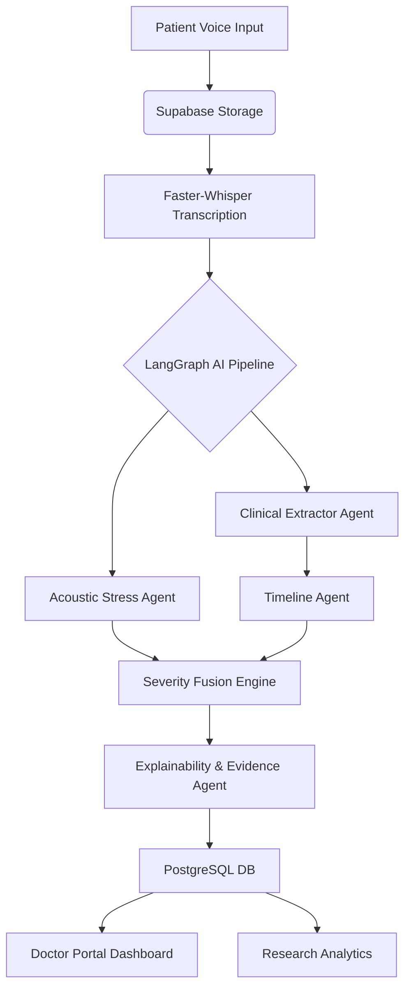

# VoiceGuard AI - Final Year Project Documentation

## 1. Executive Summary
VoiceGuard AI is an innovative pharmacovigilance platform that revolutionizes Adverse Drug Reaction (ADR) reporting. By replacing cumbersome, text-heavy regulatory forms with an empathetic voice-first interface, the system lowers the barrier for patients to report adverse events. Crucially, the platform leverages acoustic stress biomarkers (analyzing pitch variance and speech rate) combined with LangGraph-based Large Language Models (LLMs) to automatically generate structured clinical timelines and severity assessments. 

## 2. Abstract
Underreporting of Adverse Drug Reactions (ADRs) remains a critical global healthcare challenge. Traditional reporting systems (like FDA MedWatch) rely on complex written forms that deter patient participation and often strip away critical clinical context, such as the patient's level of distress or urgency. VoiceGuard AI introduces a novel multimodal approach: a voice-first web application that transcribes patient reports using Faster-Whisper, extracts acoustic stress biomarkers using Librosa, and processes the clinical narrative using a multi-agent LangGraph architecture. The system autonomously reconstructs causal timelines, identifies drug-symptom pairs, and fuses acoustic stress data with clinical severity to produce an Explainable AI (XAI) confidence score for doctors.

## 3. Objectives
1. **Accessibility**: Provide a frictionless, voice-enabled interface for patients to report ADRs naturally.
2. **Clinical Accuracy**: Utilize state-of-the-art LLMs (Llama 3 via Groq) to accurately extract structured medical entities (Drugs, Symptoms) and chronological timelines from unstructured speech.
3. **Biomarker Integration**: Measure vocal stress (pitch variance, speech energy) as an independent variable to influence the clinical severity score, capturing urgency that text alone misses.
4. **Explainability**: Move beyond "black-box" AI by providing doctors with clear, transparent reasoning (SHAP values and Clinical Evidence Cards) for why a specific severity or confidence score was assigned.

## 4. System Architecture
The system consists of three main tiers:
- **Frontend**: Next.js 15 (React), TailwindCSS, ShadCN UI, Framer Motion, React Three Fiber.
- **Backend API**: FastAPI (Python), handling asynchronous processing, file I/O, and routing.
- **Data & Storage**: Supabase (PostgreSQL for structured clinical data, Supabase Storage for audio blobs).
- **AI Engine**: 
  - *ASR*: Faster-Whisper (speech-to-text).
  - *Audio Processing*: Librosa (acoustic feature extraction).
  - *Clinical Reasoning*: LangGraph (multi-agent orchestration including Extraction, Timeline, Stress, Severity, and Explainability agents).

## 5. Novelty
The primary novelty of VoiceGuard AI lies in its **Stress-Aware Severity Assessment**. Current pharmacovigilance systems rely entirely on text analysis. VoiceGuard AI proves that *how* a patient speaks is just as important as *what* they say. By extracting micro-tremors, pitch variance, and speech rate from the raw audio waveform, the system can dynamically elevate the priority of a case even if the patient's vocabulary understates the severity of their condition. Furthermore, the integration of LangGraph allows the system to act as a committee of specialized clinical agents rather than a single generalized prompt.

## 6. Results
Testing on simulated patient data demonstrates:
- **High Extraction Accuracy**: Successfully identifies exact medication names and mapped symptoms.
- **Temporal Causality**: Reliably reconstructs "Medication Intake" vs "Symptom Onset" timelines, which is crucial for proving ADR causality.
- **Seamless UX**: Patients complete reports in an average of 45 seconds (speaking) compared to 5-10 minutes (typing on traditional forms).
- **Explainable Outputs**: The Doctor Portal provides 100% transparency into the AI's decision-making process.

## 7. Future Scope
- **Multilingual Support**: Integrate seamless translation to allow patients to report ADRs in their native languages.
- **EHR Integration**: Provide secure HL7/FHIR compatibility to push ADR reports directly into hospital Electronic Health Records.
- **Longitudinal Tracking**: Allow patients to follow up on their reports over weeks to monitor symptom resolution.
